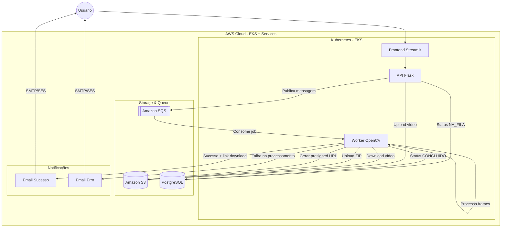

# 🎬 Hackathon Fase 5 - Sistema de Processamento de Vídeos (FIAP) 

Este é o repositório central e hub de documentação do sistema de processamento assíncrono de vídeos da startup **FIAP**. 

Para resolver o problema de travamento durante picos de acesso (apresentado no projeto base em Golang), o sistema foi totalmente reescrito em Python e refatorado para uma **Arquitetura Cloud Native Orientada a Eventos (Event-Driven)**, garantindo que nenhuma requisição seja perdida.

## 🗂️ Os 5 Repositórios do Ecossistema
A arquitetura foi dividida em microsserviços para garantir escalabilidade isolada:

1. **Infra DB (Este repositório):** Provisionamento da VPC e RDS PostgreSQL.
2. **Infra K8s:** Provisionamento do Cluster EKS, Fila SQS e Bucket S3.
3. **API Backend:** Microsserviço de ingestão (Flask). Recebe o vídeo, salva no S3 e envia para a fila SQS.
4. **Worker AI:** Robô em *background* que lê a fila SQS, baixa o vídeo, extrai os frames com OpenCV, compacta em `.zip` e faz upload pro S3.
5. **Frontend UI:** Interface rica e futurista construída em Streamlit para interação com o usuário final.

---

## 🗺️ 1. Diagrama de Arquitetura (Orientada a Eventos)



---

## 🚀 2. Guia de Deploy e Execução

Para subir todo o ecossistema na AWS Academy do zero, as pipelines (GitHub Actions) devem ser executadas **exatamente na ordem abaixo**:

### ETAPA 1: Infraestrutura Core
1. **No repositório `05_Infra_DB`**:
   * Preencha os Secrets: `AWS_ACCESS_KEY_ID`, `AWS_SECRET_ACCESS_KEY`, `AWS_SESSION_TOKEN`, `AWS_REGION` (`us-east-1`), `AWS_TF_STATE_BUCKET` (`oficina-techchallenge-terraform-state-fase5-2026`), `DB_PASS` e `ALLOWED_IP` (`0.0.0.0/0`).
   * Rode a pipeline **`🪣 Bootstrap Terraform Remote State (S3)`**.
   * Em seguida, rode a pipeline **`🚀 Terraform Apply (Infra DB)`**.
   * *O que anotar:* A URL gerada no output `rds_host`.
   
2. **No repositório `05_Infra_K8s`**:
   * Preencha os Secrets da AWS e o `TERRAFORM_ADMIN_ARN` (sua LabRole).
   * Rode a pipeline **`🚀 Deploy Infra K8s (EKS + S3 + SQS)`**.
   * *O que anotar:* A URL do Bucket (`s3_videos_bucket_name`), a URL da fila (`sqs_video_queue_url`) e as duas URLs do ECR (`ecr_api_url` e `ecr_worker_url`).

### ETAPA 2: Aplicações (Microsserviços)
3. **No repositório `05_API`**:
   * Preencha os Secrets: AWS, Banco de dados (`DB_HOST` gerado no passo 1), `JWT_SECRET`, `S3_BUCKET_NAME`, `SQS_QUEUE_URL` e `ECR_REPO` (`ecr_api_url`).
   * Rode a pipeline **`🚀 CI/CD - Hackathon API`**.
   * Para descobrir a URL da API, abra seu terminal na AWS e rode:
     ```bash
     aws eks update-kubeconfig --region us-east-1 --name hackathon-eks-cluster
     kubectl get svc hackathon-api-lb
     ```
   * *O que anotar:* Copie o endereço da coluna `EXTERNAL-IP`.

4. **No repositório `05_Worker`**:
   * Preencha os Secrets da AWS, Banco de Dados, S3, SQS, além das credenciais SMTP de envio de falhas (`EMAIL_OFICINA` e `EMAIL_SENHA_APP`). Adicione a URL do ECR no secret `ECR_REPO_WORKER`.
   * Rode a pipeline **`🚀 CI/CD - Hackathon Worker`**.

5. **No repositório `05_Frontend`**:
   * Preencha os Secrets da AWS e do `ECR_REPO` (Use a mesma da API).
   * Preencha o Secret `API_URL` com `http://` seguido do `EXTERNAL-IP` da API anotado no Passo 3.
   * Rode a pipeline **`🚀 CI/CD - Hackathon Frontend`**.

---
## 📊 3. Monitoramento e Observabilidade (AWS CloudWatch)

O sistema utiliza **Amazon CloudWatch + Container Insights** como solução de observabilidade nativa na AWS, substituindo ferramentas como Prometheus e Grafana.

Essa abordagem fornece visibilidade completa da infraestrutura executada no EKS, incluindo API, Worker e serviços auxiliares.


### 🪵 Logs Centralizados

Os logs das aplicações podem ser acessados diretamente no AWS Console:

```bash
CloudWatch → Logs → Log groups
```

Dentro dos log groups é possível visualizar:

* Logs da API Flask
* Logs do Worker de processamento
* Erros de execução (ex: OpenCV, S3, SQS)
* Eventos de CrashLoopBackOff no Kubernetes


### 📡 Métricas do Cluster (EKS)

As métricas do cluster são disponibilizadas via:

```bash
CloudWatch → Container Insights → Performance Monitoring
```

Incluindo:

* Uso de CPU e memória por pod e node
* Restart count de containers
* Status de deployments e pods
* Saúde geral do cluster EKS
* Métricas de performance de serviços


### 🚨 Benefícios da Solução

* Observabilidade totalmente gerenciada pela AWS
* Sem necessidade de infraestrutura adicional (Prometheus/Grafana)
* Integração nativa com EKS, S3 e SQS
* Escalabilidade automática de monitoramento
* Debug simplificado em ambiente distribuído

  
## 💻 4. Como Acessar e Testar o Sistema (Ponta a Ponta)

Após o sucesso em todas as pipelines, obtenha o link público de acesso à interface do usuário. No terminal da AWS, execute:
```bash
aws eks update-kubeconfig --region us-east-1 --name hackathon-eks-cluster
kubectl get svc hackathon-frontend-lb
```

Copie o endereço da coluna **`EXTERNAL-IP`**, cole no seu navegador (com `http://` na frente) e siga o roteiro de testes:

1. **Autenticação Segura:** Na barra lateral, acesse **Novo Registro**, preencha um ID, E-mail e Senha. Em seguida, vá na aba **Acesso** e faça o Login.
2. **Alta Disponibilidade (Upload):** Na tela principal destravada, selecione um arquivo de vídeo (ex: `.mp4`) e clique em **Inicializar Extração**. O sistema responderá instantaneamente através da arquitetura assíncrona, enviando os dados para a fila do Amazon SQS.
3. **Processamento (Worker):** No painel inferior, seu vídeo aparecerá com a flag 🟡 `STATUS: NA_FILA`. Aguarde alguns minutos enquanto a inteligência artificial no cluster EKS recorta as imagens e gera o arquivo ZIP.
4. **Sincronização e Download:** Clique no botão **SYNC ⟳**. O status mudará para 🟢 `STATUS: CONCLUIDO` e um link **Download Pacote Compresso (.ZIP)** será liberado. Esse link utiliza *AWS Presigned URLs* para garantir acesso temporário e seguro diretamente do S3.
5. **Tratamento de Erros:** Caso o arquivo não seja processável, o Worker atualizará o status para 🔴 `ERRO` e disparará um e-mail de alerta automático para o contato cadastrado.


