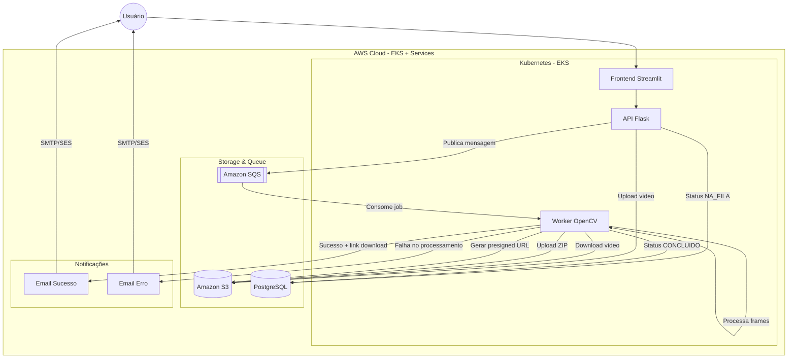

# 🎬 Hackathon Fase 5 - Sistema de Processamento de Vídeos (FIAP X) 

Este é o repositório central e hub de documentação do sistema de processamento assíncrono de vídeos da startup **FIAP X**. 

Para resolver o problema de travamento durante picos de acesso (apresentado no projeto base em Golang), o sistema foi totalmente reescrito em Python e refatorado para uma **Arquitetura Cloud Native Orientada a Eventos (Event-Driven)**, garantindo que nenhuma requisição seja perdida e que múltiplos vídeos sejam processados simultaneamente.

## 📸 Interface do Usuário (CyberFrame AI)

Abaixo temos a interface final do sistema, desenvolvida com Streamlit e estilizada com CSS customizado (Cyberpunk/Neon theme), fornecendo uma experiência imersiva e reativa ao usuário.


## 🗂️ Os 5 Repositórios do Ecossistema
A arquitetura foi dividida em microsserviços para garantir escalabilidade isolada.

**Links dos Repositórios Oficiais:**
1. **Infra DB:** [Oficina_FIAP_Tech_Challenge_05_Infra_DB](https://github.com/EvelynLopesSS/Oficina_FIAP_Tech_Challenge_05_Infra_DB) - Provisionamento da VPC e RDS PostgreSQL.
2. **Infra K8s:** [Oficina_FIAP_Tech_Challenge_05_Infra_K8s](https://github.com/EvelynLopesSS/Oficina_FIAP_Tech_Challenge_05_Infra_K8s) - Provisionamento do Cluster EKS, Fila SQS e Bucket S3.
3. **API Backend:** [Oficina_FIAP_Tech_Challenge_05_API](https://github.com/EvelynLopesSS/Oficina_FIAP_Tech_Challenge_05_API) - Microsserviço de ingestão (Flask). Recebe o vídeo, salva no S3 e envia para a fila SQS.
4. **Worker AI:** [Oficina_FIAP_Tech_Challenge_05_Worker](https://github.com/EvelynLopesSS/Oficina_FIAP_Tech_Challenge_05_Worker) - Robô em *background* que lê a fila SQS, baixa o vídeo, extrai os frames com OpenCV, compacta em `.zip` e faz upload pro S3.
5. **Frontend UI:** [Oficina_FIAP_Tech_Challenge_05_Frontend](https://github.com/EvelynLopesSS/Oficina_FIAP_Tech_Challenge_05_Frontend) - Interface rica e futurista construída em Streamlit para interação com o usuário final.

---

## 🗺️ 1. Diagrama de Arquitetura (Orientada a Eventos)



---

## 🚀 2. Guia de Deploy e Execução

Para subir todo o ecossistema na AWS Academy do zero, as pipelines (GitHub Actions) devem ser executadas **exatamente na ordem abaixo**:

### ETAPA 1: Infraestrutura Core
1. **No repositório `05_Infra_DB`**:
   * Preencha os Secrets: `AWS_ACCESS_KEY_ID`, `AWS_SECRET_ACCESS_KEY`, `AWS_SESSION_TOKEN`, `AWS_REGION` (`us-east-1`), `AWS_TF_STATE_BUCKET` (`oficina-techchallenge-terraform-state-fase5-2026`), `DB_PASS` e `ALLOWED_IP` (`0.0.0.0/0`).
   * Rode a pipeline **`🪣 Bootstrap Terraform Remote State (S3)`**.
   * Em seguida, rode a pipeline **`🚀 Terraform Apply (Infra DB)`**.
   * *O que anotar:* A URL gerada no output `rds_host`.
   
2. **No repositório `05_Infra_K8s`**:
   * Preencha os Secrets da AWS e o `TERRAFORM_ADMIN_ARN` (sua LabRole).
   * Rode a pipeline **`🚀 Deploy Infra K8s (EKS + S3 + SQS)`**.
   * *O que anotar:* A URL do Bucket (`s3_videos_bucket_name`), a URL da fila (`sqs_video_queue_url`) e as duas URLs do ECR (`ecr_api_url` e `ecr_worker_url`).

### ETAPA 2: Aplicações (Microsserviços)
3. **No repositório `05_API`**:
   * Preencha os Secrets: AWS, Banco de dados (`DB_HOST` gerado no passo 1), `JWT_SECRET`, `S3_BUCKET_NAME`, `SQS_QUEUE_URL` e `ECR_REPO` (`ecr_api_url`).
   * Rode a pipeline **`🚀 CI/CD - Hackathon API`**.
   * Para descobrir a URL da API, abra seu terminal na AWS e rode:
     ```bash
     aws eks update-kubeconfig --region us-east-1 --name hackathon-eks-cluster
     kubectl get svc hackathon-api-lb
     ```
   * *O que anotar:* Copie o endereço da coluna `EXTERNAL-IP`.

4. **No repositório `05_Worker`**:
   * Preencha os Secrets da AWS, Banco de Dados, S3, SQS, além das credenciais SMTP de envio de falhas (`EMAIL_OFICINA` e `EMAIL_SENHA_APP`). Adicione a URL do ECR no secret `ECR_REPO_WORKER`.
   * Rode a pipeline **`🚀 CI/CD - Hackathon Worker`**.

5. **No repositório `05_Frontend`**:
   * Preencha os Secrets da AWS e do `ECR_REPO` (Use a mesma da API).
   * Preencha o Secret `API_URL` com `http://` seguido do `EXTERNAL-IP` da API anotado no Passo 3.
   * Rode a pipeline **`🚀 CI/CD - Hackathon Frontend`**.

---

## 📊 3. Monitoramento e Observabilidade (AWS CloudWatch)

O sistema utiliza **Amazon CloudWatch + Container Insights** como solução de observabilidade nativa na AWS, substituindo ferramentas como Prometheus e Grafana, garantindo performance e mitigando o alto consumo de RAM no cluster EKS.

*   **Logs Centralizados:** Disponíveis em `CloudWatch → Logs → Log groups` (Engloba logs da API Flask, do Worker OpenCV e eventos do Kubernetes).
*   **Métricas do Cluster:** Disponíveis em `CloudWatch → Container Insights → Performance Monitoring` (Uso de CPU/Memória por pod, saúde do cluster e *restart counts*).

---

## 🧪 4. Qualidade e Testes Automatizados

Para garantir a confiabilidade do processamento assíncrono (o core business da aplicação), foram implementados testes unitários automatizados no microsserviço **Worker**.

- **Isolamento com Mocks:** Utilizando `pytest` e `unittest.mock`, simulamos o comportamento da AWS (S3, SQS, SES) e do banco de dados (PostgreSQL). Isso permite que a esteira de CI/CD valide a lógica de negócio rapidamente sem depender de infraestrutura externa.
- **Validação de IA e Visão Computacional:** As funções da biblioteca OpenCV (`cv2`) foram mockadas para garantir que o algoritmo de fatiamento de frames e compressão ZIP funcione corretamente em qualquer ambiente.
- **Integração Contínua (CI):** Os testes são executados automaticamente no GitHub Actions antes de cada deploy. Caso um teste falhe, a imagem Docker não é substituída, garantindo o princípio de *Fail Fast*.

---

## 💻 5. Como Acessar e Testar o Sistema (Ponta a Ponta)

Após o sucesso em todas as pipelines, obtenha o link público de acesso à interface do usuário. No terminal da AWS, execute:
```bash
aws eks update-kubeconfig --region us-east-1 --name hackathon-eks-cluster
kubectl get svc hackathon-frontend-lb
```

Copie o endereço da coluna **`EXTERNAL-IP`**, cole no seu navegador (com `http://` na frente) e siga o roteiro de testes:

1. **Autenticação Segura:** Na barra lateral, acesse **Novo Registro**, preencha um ID, E-mail e Senha. Em seguida, faça o Login.
2. **Alta Disponibilidade e Paralelismo (Upload):** Na tela principal destravada, selecione um arquivo de vídeo de **até 200 MB** (limite padrão de segurança configurado) e clique em **Inicializar Extração**. 
   * *Dica de Paralelismo:* O sistema é 100% assíncrono. Você pode enviar vários vídeos seguidos sem aguardar o processamento do anterior. Todos serão enfileirados com segurança no AWS SQS e não haverá perda de requisição (requisito atendido).
3. **Processamento Assíncrono (Worker):** No painel inferior, o(s) vídeo(s) aparecerão com a flag 🟡 `STATUS: NA_FILA`. Aguarde enquanto o(s) Worker(s) no cluster EKS baixam, recortam as imagens e geram o arquivo ZIP.
4. **Sincronização e Download:** Clique no botão **SYNC ⟳**. O status mudará para 🟢 `STATUS: CONCLUIDO` e o usuário receberá automaticamente um e-mail de sucesso contendo o link **Download Pacote Compresso (.ZIP)**. Esse link utiliza *AWS Presigned URLs* para garantir acesso temporário (24h) e seguro diretamente do S3.
5. **Tratamento de Erros:** Caso o arquivo submetido esteja corrompido ou seja um formato inválido, o Worker interceptará a falha, atualizará o status para 🔴 `ERRO` e disparará um e-mail de alerta automático alertando o cliente sobre o ocorrido.
